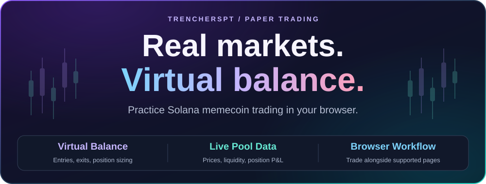
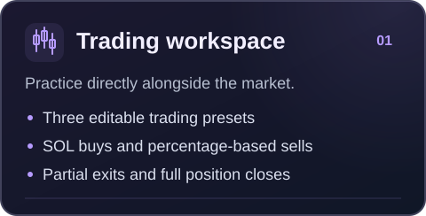
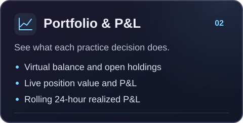
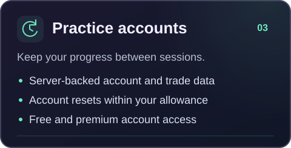
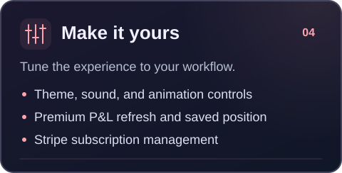
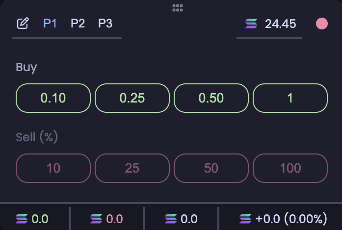
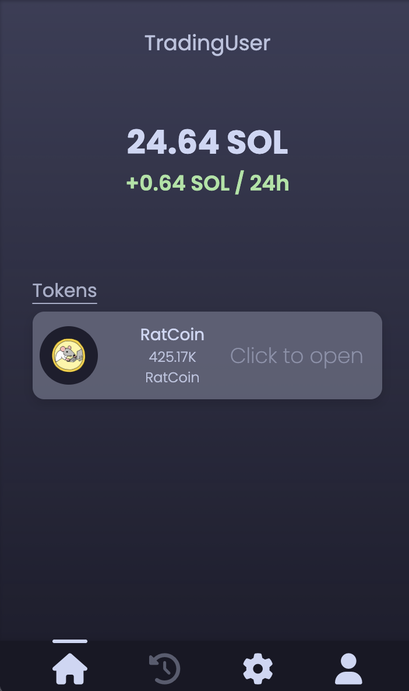
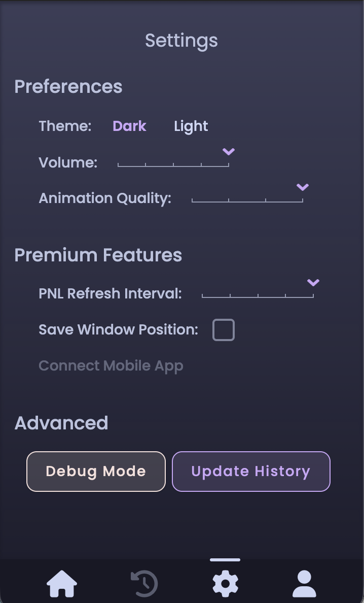
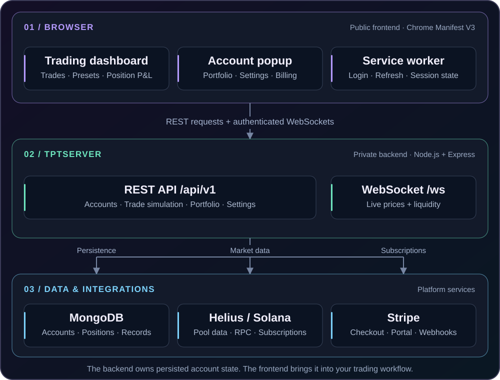

<a name="top"></a>

<div align="center">
  
  <h1>Trenchers Paper Trading</h1>
  <p>
    
  </p>
  <p>
    <a href="https://github.com/Gadzzaa/TrenchersPaperTrading/releases/latest"></a>
    <a href="https://github.com/Gadzzaa/TrenchersPaperTrading/actions/workflows/validate.yml"></a>
    <a href="./LICENSE"></a>
    <a href="./manifest.json"></a>
  </p>
  <p>
    <a href="./CHANGELOG.md">Changelog</a> ·
    <a href="https://github.com/Gadzzaa/TrenchersPaperTrading/issues">Report an issue</a> ·
    <a href="./CONTRIBUTING.md">Contribute</a>
  </p>
  <p>
    <a href="#features">Features</a> ·
    <a href="#preview">Preview</a> ·
    <a href="#getting-started">Getting started</a> ·
    <a href="#architecture">Architecture</a> ·
    <a href="#backend-services">Backend services</a> ·
    <a href="#development">Development</a>
  </p>
</div>

## Overview

**Trenchers Paper Trading (TrenchersPT)** is a paper-trading platform for practicing entries, exits, position sizing,
and trading discipline in the Solana memecoin market. Use virtual SOL to build positions, follow live pool prices,
and review your results while browsing supported trading platforms.

The platform combines **TrenchersPaperTrading**, the public Chrome-extension frontend in this repository, with
**TPTServer**, its private backend. The extension provides the trading interface; the backend processes simulated
trades, persists account data, and supplies market updates.

The current browser integration is **Axiom**. Additional trading-platform integrations are planned.

> [!NOTE]
> **Paper trading uses virtual funds.** Trades submitted through the extension do not sign blockchain transactions,
> place real orders, or spend real SOL. No wallet funding is required to practice. The trading platform's own controls
> retain their usual behavior.

## Features

<p align="center">
  &nbsp;
  
</p>
<p align="center">
  &nbsp;
  
</p>

Free and premium accounts have different allowances for positions, resets, WebSocket connections, and watched pools.
These rules are enforced by the backend. Subscription billing is separate from the virtual SOL used for practice.

## Preview

All balances, positions, and P&L in these screenshots belong to paper-trading accounts. Click a screenshot to inspect it at full size.

### Trading dashboard

Switch presets, choose a buy amount or sell percentage, and follow a position from one panel.

<p align="center">
  <a href="./Screenshots/demo/trading-dashboard.png"></a>
</p>

### Portfolio and preferences

Review your holdings and results, then configure the extension's appearance and available premium settings.

<p align="center">
  <a href="./Screenshots/demo/paper-portfolio.png"></a>&nbsp;&nbsp;
  <a href="./Screenshots/demo/settings.png"></a>
</p>
<p align="center"><sub>Paper portfolio &nbsp; · &nbsp; Personal preferences</sub></p>

## Getting started

Use a packaged extension from [GitHub Releases](https://github.com/Gadzzaa/TrenchersPaperTrading/releases), or build the
source using the [development instructions](#development). An unpacked release should be loaded from the folder that
contains `manifest.json`.

1. Open `chrome://extensions/`, enable **Developer mode**, and select **Load unpacked**.
2. Select the extension folder, then open the **Trenchers Paper Trading** popup.
3. Create an account with a virtual starting balance, or sign in to an existing account.
4. Open a supported token page. For the current Axiom integration, the dashboard appears on `/meme/...` pages.
5. Choose a preset and submit a paper buy. Follow the position, then sell a percentage when you want to exit.
6. Open the popup to review your portfolio, realized P&L, settings, or reset allowance.

A reachable, compatible backend is required for account access, trading, and portfolio services. Source builds must
be configured for the intended backend before loading; see [backend configuration](#2-select-the-backend).

## Architecture

<p align="center">
  
</p>

**TrenchersPaperTrading — public frontend.** Page integration, an extension-owned dashboard iframe, the account
popup, presets, preferences, and live position display. Its service worker coordinates authentication and sessions.

**TPTServer — private backend.** Account and portfolio persistence, paper-trade validation and execution, account
rules, live market data, and subscription billing. MongoDB stores platform records, Helius supplies Solana data,
and Stripe manages billing.

### Technology stack

<p align="center">

  
  
</p>
<p align="center">
  
  
  
</p>

<details>
<summary><strong>View the stack by layer</strong></summary>

| Layer | Technologies |
| --- | --- |
| Extension | Chrome Manifest V3, vanilla JavaScript ES modules, HTML, CSS, Chrome Storage API |
| Content-script build | Webpack |
| Backend API | Node.js, Express, Zod request validation |
| Persistence | MongoDB, repositories, database transactions |
| Live market data | Solana Web3 and SPL Token libraries, Raydium SDK, Helius RPC, WebSockets |
| Trade calculations | Decimal.js for decimal arithmetic and explicit rounding |
| Authentication | JWT access tokens, rotating refresh sessions, bcrypt password hashing |
| Billing | Stripe Checkout, customer portal, verified webhooks |
| Operations | Docker, structured Pino logs, health checks, metrics, Jest unit and integration tests |

</details>

### Versions and compatibility

| Component | Version or status | Reference |
| --- | --- | --- |
| Frontend release | Latest published version is shown in the release badge above | [Releases](https://github.com/Gadzzaa/TrenchersPaperTrading/releases) · [Changelog](./CHANGELOG.md) |
| Extension architecture | Chrome Manifest V3 | [Manifest](./manifest.json) |
| REST API | Version 1 · `/api/v1` | [API overview](#api-overview) |
| Live market stream | Authenticated WebSocket · `/ws` | [Backend services](#backend-services) |
| Development runtime | Node.js 24 and npm | [Validation workflow](./.github/workflows/validate.yml) |
| Browser integrations | Axiom available; additional platforms planned | [Integration entry points](#repository-layout) |

## Backend services

**TPTServer is the backend that powers TrenchersPT.** It provides the account, simulation, data, and billing services
used by this frontend.

| Service | Responsibility |
| --- | --- |
| **Accounts and authentication** | Register and authenticate users, hash passwords, issue short-lived access JWTs, rotate refresh sessions, and revoke refresh sessions on logout. |
| **Paper-trade execution** | Validate buys and percentage-based sells; apply pool-based pricing, slippage, simulated fees, and decimal rounding. |
| **Portfolio persistence** | Store virtual SOL balances, token holdings, trading records, and realized P&L events in MongoDB. |
| **Consistent updates** | Use database transactions for trade and reset mutations, with idempotency keys to prevent repeated requests from applying the same operation twice. |
| **Market data and metadata** | Resolve supported pools, read their reserves and token metadata, calculate prices and liquidity, and cache pool data. |
| **Live pool monitoring** | Manage upstream Solana subscriptions and deliver authenticated price and liquidity updates over WebSockets, with connection and watched-pool limits. |
| **Pool migration handling** | Resolve supported bonding-curve migrations and move active pool monitoring to the destination pool. Trade processing can update position and trading records to the live pool address. |
| **Account rules and preferences** | Enforce position limits, reset allowances, premium access, and server-backed settings. |
| **Subscriptions and billing** | Create Checkout and customer-portal sessions, process signed Stripe webhooks, and maintain subscription status and entitlements. |
| **Extension compatibility** | Compare the installed extension version with the published Chrome Web Store version. |
| **Service operations** | Validate requests, apply rate limits and timeouts, manage allowed origins, return structured errors, and expose health and monitoring endpoints. |

### Supported pool data

The current backend has active fetch handlers for:

- **Pump.fun** bonding curves and **PumpSwap** AMM pools.
- **Raydium** AMM v4, CPMM, and launchpad pools.
- **Sugar** and **Boop** pools.

Pool support and browser-platform support are separate: a trading page may display a token whose pool type the
backend cannot process. Compatibility depends on the installed frontend and deployed backend versions.

### API overview

REST endpoints use the **`/api/v1`** prefix. Live monitoring uses **`/ws`**.

<details>
<summary><strong>View REST endpoints, authentication, and WebSocket behavior</strong></summary>

Paths below are relative to `/api/v1`.

| Area | Endpoints |
| --- | --- |
| Authentication | `POST /create-account`, `POST /login`, `POST /refresh-session`, `GET /check-session`, `DELETE /logout` |
| Account and portfolio | `GET /balance`, `GET /portfolio`, `GET /popup-data`, `GET /trade-log`, `PATCH /reset` |
| Paper trading | `POST /buy`, `POST /sell` |
| Preferences | `GET /get-settings`, `POST /save-settings` |
| Account connection limits | `GET /websocket-limits` |
| Billing | `POST /create-checkout-session`, `POST /create-portal-session` |
| Service and version checks | `GET /health`, `GET /latest?version=<extension-version>` |

Protected routes use `Authorization: Bearer <access-token>`. Refresh-session rotation uses an `HttpOnly`, `Secure`
cookie; the extension's service worker coordinates these requests. Buys, sells, resets, and Checkout-session
creation require an `Idempotency-Key`, which the frontend generates and preserves when retrying a request.

Live monitoring uses **`/ws`**, outside the REST prefix. A client authenticates with an access token before requesting
pool watches; token expiry requires reauthentication through a new connection. The extension manages reconnection
and session refresh.

The backend also receives Stripe events at `POST /api/v1/stripe-webhook` and provides token-protected operational
endpoints at `GET /api/v1/health/detailed` and `GET /api/v1/metrics`.

</details>

### Backend availability

> [!IMPORTANT]
> **TPTServer's source code is private and will remain private.** This repository distributes the frontend.
> The backend implementation, provider credentials, and deployment configuration are maintained separately;
> cloning this repository does not provide a complete self-hosted installation.

Users connect to the hosted service. Local backend development requires separate authorization and access to the
private repository; its setup and deployment are maintained there.

## Development

### Prerequisites

- **Node.js 24 and npm**, matching the frontend CI workflows.
- **Google Chrome** with extension Developer mode enabled.
- Access to the hosted service, or an authorized local TPTServer instance compatible with `/api/v1`.

### 1. Install dependencies

```bash
git clone https://github.com/Gadzzaa/TrenchersPaperTrading.git
cd TrenchersPaperTrading
npm ci
```

### 2. Select the backend

Set `USE_LOCAL` in [config.js](./config.js) before loading the extension. To use the hosted service:

```js
export const USE_LOCAL = false;
```

| Mode | REST API | WebSocket |
| --- | --- | --- |
| Hosted: `USE_LOCAL = false` | `https://trencherspapertrading.xyz/api/v1` | `wss://trencherspapertrading.xyz/ws` |
| Local: `USE_LOCAL = true` | `http://localhost:3000/api/v1` | `ws://localhost:3000/ws` |

Local mode assumes an authorized backend is already running on port `3000`. Installing frontend dependencies does
not start that service. The release preparation script sets `USE_LOCAL = false` for packaged releases.

For a custom backend host, keep [config.js](./config.js),
[Websocket.js](./Scripts/Dashboard/Config/Websocket.js), the `connect-src` policy in
[manifest.json](./manifest.json), and the backend's allowed origins in agreement. Backend secrets stay in the backend
environment and must never be embedded in the extension.

### 3. Build the content script

```bash
npx webpack
```

Webpack builds `Scripts/Injection/inject.js` into `Scripts/Injection/inject.bundle.js`, which is referenced by the
manifest. The popup and dashboard load their own JavaScript modules directly. There is no separate frontend web
server to start.

### 4. Load and verify the extension

Load the **repository root** through `chrome://extensions/` as described in [getting started](#getting-started).
After editing the injection modules, rebuild the bundle. Reload the extension and refresh the trading page after
changes; also reopen the popup if it was already open.

For a frontend change, verify the affected flow in Chrome. Useful checks include account sign-in and restoration,
dashboard injection and route changes, paper buys and partial/full sells, balance and P&L updates, preset editing,
and preferences.

The [frontend validation workflow](./.github/workflows/validate.yml) installs dependencies, rebuilds the content
script, and checks that the committed bundle matches the generated output. Include the regenerated
`inject.bundle.js` when changing its source modules. This repository does not currently define an `npm test` script;
backend unit and integration tests live in TPTServer.

### Repository layout

<details>
<summary><strong>Explore the source structure and integration entry points</strong></summary>

```text
TrenchersPaperTrading/
├── manifest.json                 Extension permissions, scripts, and resources
├── config.js                     Backend selection and debug configuration
├── popup.html                    Account, portfolio, settings, and billing UI
├── dashboard.html                In-page paper-trading dashboard
├── webpack.config.js             Injected content-script build
├── Scripts/
│   ├── Injection/                Route detection, injection, dragging, bundled script
│   ├── Dashboard/                Trade controls, presets, positions, P&L, WebSockets
│   ├── Popup/                    Popup navigation and account/settings interfaces
│   ├── Account/                  Account data, preferences, subscriptions
│   ├── Transactions/             Paper-trade API requests and position updates
│   ├── Server/                   API client, session coordination, service checks
│   ├── ErrorHandling/            Shared errors and user-facing error handling
│   ├── Utils/                    Storage, initialization, notifications, UI helpers
│   └── healthChecker.js          Background service worker
├── Styles/                       Dashboard, popup, and theme styles
├── Images/                       Icons and image assets
├── Sounds/                       Interface audio
├── Screenshots/                  README visuals; excluded from extension packages
│   ├── demo/                     Product screenshots
│   └── readme/                   Banner, feature panels, and architecture SVGs
└── .github/workflows/            Frontend validation and release automation
```

The integration entry points are [manifest.json](./manifest.json), which declares the pages receiving the content
script, and [RouteHelper.js](./Scripts/Injection/RouteHelper.js), which controls dashboard injection. Additional
platform integrations should also account for page-to-dashboard messaging and portfolio links.

</details>

### Troubleshooting

<details>
<summary><strong>Dashboard, connection, session, and build troubleshooting</strong></summary>

| Symptom | What to check |
| --- | --- |
| Dashboard does not appear | Use a token route supported by the integration, confirm the content script matches the site, then reload the extension and page. |
| API calls fail or return 404 | Verify the selected backend is reachable and the REST base URL includes `/api/v1`. |
| Session cannot be restored | Check the backend's allowed extension origin and whether the browser accepts its refresh cookie. |
| Trading or live P&L is unavailable | Confirm the WebSocket connection is authenticated, the pool is supported, and account connection/watch limits have not been reached. |
| Injection changes do not appear | Run `npx webpack`, reload the unpacked extension, and refresh the trading tab. |

</details>

## Scope and limitations

Paper fills are calculated from supported market data using the backend's simulation rules. They do not reproduce
every effect of real execution, including transaction inclusion, priority fees, MEV, network congestion, or
size-dependent market impact. Simulated returns can differ from real trading results.

Account services and live updates depend on backend connectivity and upstream data availability. This is an online
platform. Browser integrations and pool coverage may need updates as trading sites and Solana programs change.

## Contributing and support

Frontend contributions are welcome through pull requests. Follow [CONTRIBUTING.md](./CONTRIBUTING.md), use
Conventional Commits where possible, and include screenshots and verification steps for UI changes. See
[CHANGELOG.md](./CHANGELOG.md) for release history.

Report frontend bugs or propose platform integrations through
[GitHub Issues](https://github.com/Gadzzaa/TrenchersPaperTrading/issues). Include the extension version, affected
platform or route, and steps to reproduce. Backend changes are managed separately in the private TPTServer repository.

Report vulnerabilities privately through the process in [SECURITY.md](./SECURITY.md). Keep passwords, tokens, and
private configuration out of issues, screenshots, and pull requests.

## License

The frontend is licensed under the [MIT License](./LICENSE), copyright © 2026 Gadzzaa.
That license covers the code distributed in this repository; it does not include the private TPTServer codebase or
grant access to the hosted service.

---

<p align="center">
  <strong>Trenchers Paper Trading</strong><br />
  <sub>Virtual funds. Live markets. Practice with purpose.</sub><br /><br />
  <a href="#top">Back to top</a> ·
  <a href="https://github.com/Gadzzaa/TrenchersPaperTrading/releases">Releases</a> ·
  <a href="./CONTRIBUTING.md">Contributing</a> ·
  <a href="./SECURITY.md">Security</a> ·
  <a href="./LICENSE">License</a>
</p>
