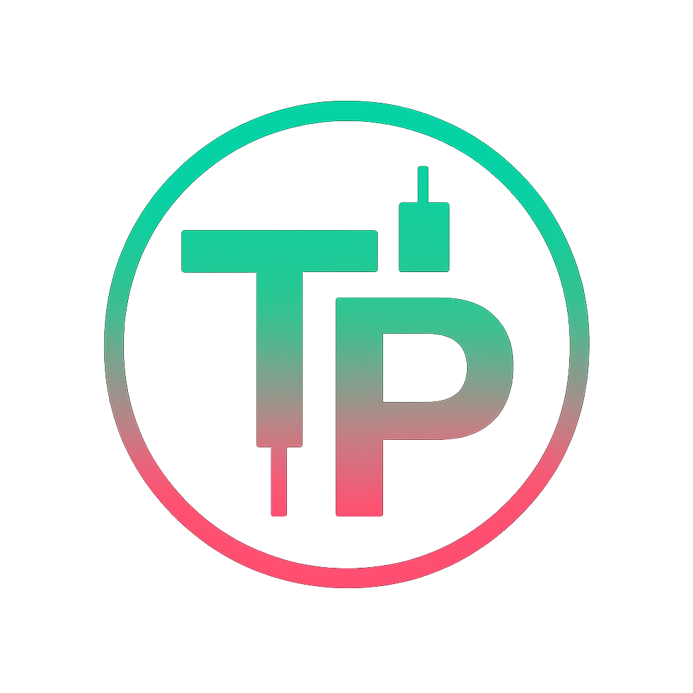

# Trenchers Paper Trading 🧠💸



**Trenchers Paper Trading** is a Chrome extension designed for paper trading memecoins on [Axiom](https://axiom.trade). Practice your trading strategies without risking real SOL — perfect for beginners and degen explorers.

---

## 🚀 Features

- Seamless UI integrated with Axiom's trading interface
- Real-time simulated balance updates
- Configurable buy/sell presets
- PNL tracking and account management
- Fully client-side and secure (with backend API support)

---

## 🛠 How to Use

### 1. Clone the Repository
```bash
git clone https://github.com/Gadzzaa/TrenchersPaperTrading.git
```

### 2. Install as a Chrome Extension
- Open Chrome and navigate to `chrome://extensions/`
- Enable **Developer Mode**
- Click **Load unpacked** and select the `TrenchersPaperTrading` folder

💡 The extension will auto-inject on any page under `https://axiom.trade/meme/*`.

---

## 📸 Screenshots


---

## 🔌 Backend Requirement

> ⚠️ Requires [TPTServer](https://github.com/Gadzzaa/TPTServer) to be running.
- Without the backend, account system, portfolio tracking, and trades will not work.

---

## 🎥 Demo Video

A full walkthrough of the extension and backend in action:  
📽️ `Trailer` *(https://youtu.be/snUPfnYgfkY?si=M-MhE1YhrxjvOb4e)*

---

## 📄 License

MIT License © 2025 Gadzzaa
